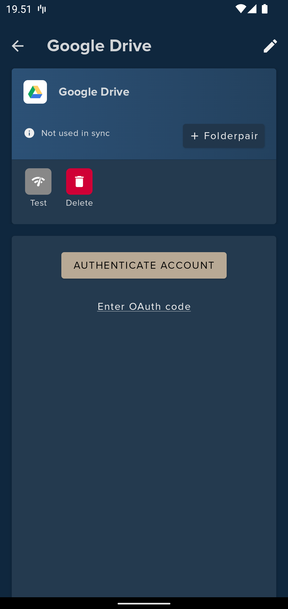
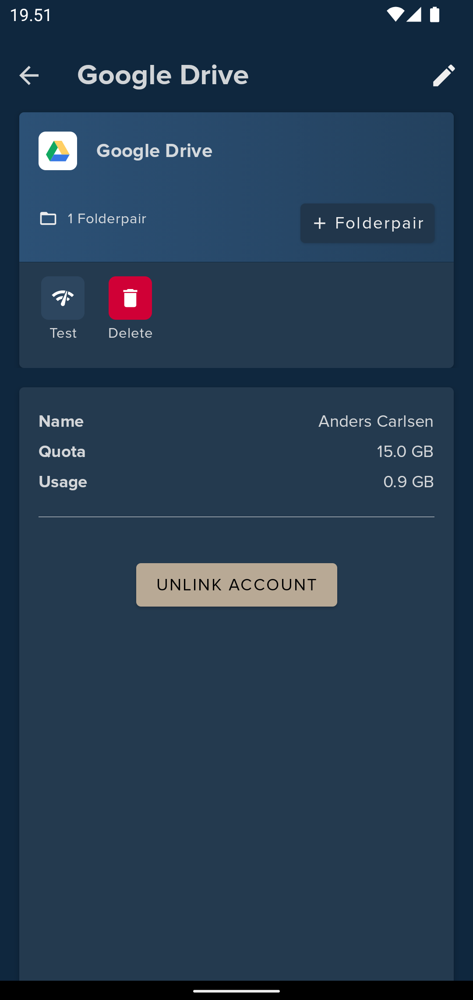

# Add cloud service account

A cloud service account can be added by providing login credentials for FolderSync to be able to login and access fils. 
Some cloud services support OAuth authentication where you login on the cloud provider website. In those cases FolderSync will not have access to or store your login credentials, but are granted an access token that can be revoked later.

## Using OAuth authentication
For cloud services like Box, Dropbox Google Drive, Hubic, OneDrive, Yandex and pCloud you can initiate the browser based authentication flow by pressing [Authenticate Account] button. After you have authenticated in the browser it should redirect you back to the app and you can save the account.

If you are instead redirect back to a webpage, you can copy the fallback OAuth code, press back until you see the account screen in FolderSync and again and use the [Enter OAuth code] button to enter the code.

!!! warning

    For pCloud access the manual fallback method will not work when using EU server.

### Example - Google Drive
In this example press the [Authenticate account] button to initiate authentication in a browser. When done, you should be returned to FolderSync and see second screen. You're account should now be ready to use.

{: style="height:570px;width:270px"}
{: style="height:570px;width:270px"}

## Using login credentials
For login based cloud providers like CloudMe, HiDrive, Livedrive, MEGA, MyDrive.ch, MyKolab.com, NetDocuments, Storegate, SugarSync etc. you will need to enter your credentials to the service to connect.

